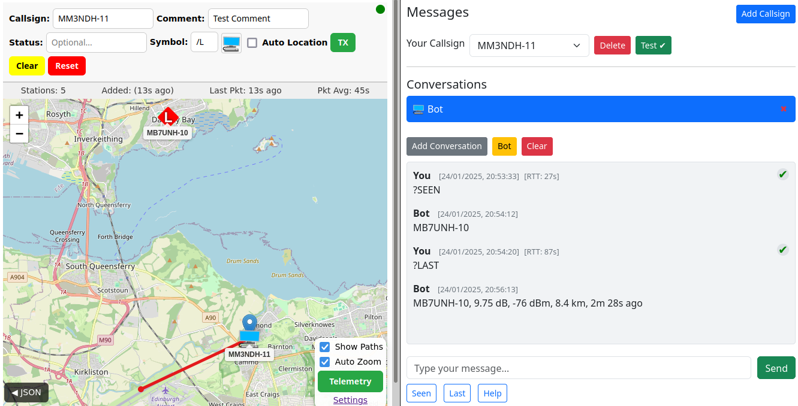
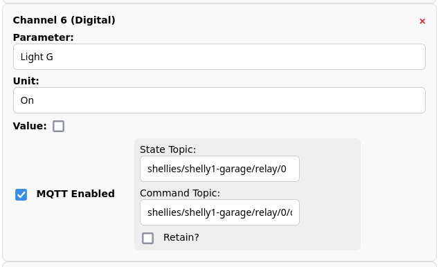
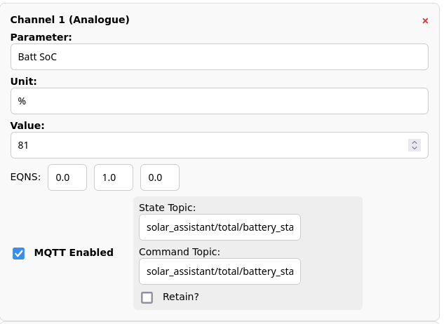
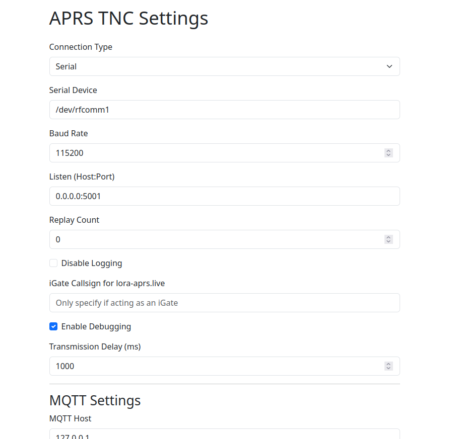

# aprs-tnc-web-bridge

Documentation to come. See INSTALL to get going and http://127.0.0.1:5001/static/readme.html for more details. 

Currently designed for a good sized screen (PC/laptop etc) rather than a phone as there are already apps for that. Note: This is very much early stages and not all packets are decoded or utilised.

At a very basic level this sends raw and decoded APRS packets over websockets as JSON and receives raw packets and formatted location/message types over a JSON based API.

Essentially it is KISS TNC (Serial/TCP) & APRS-IS direct -> Web interface (websockets/JSON API) with MQTT support for APRS analogue and digital telemetry channels as well as the usual mapping and messaging features.

TNCs which have been tested include CA2RXU's LoRa iGate and Tracker firmware, NinoTNC and the VGC VR-N76 HT.

It can also act as a transparent bridge between a TNC and TCP, for example to allow a serial TNC to be accessible over a network. Tested with various software including APRSDroid.

The telemetry manager handles all 13 channels and takes care of sequence, unit, EQNS updates etc. Has been tested with Tasmota and Shelly switches over MQTT (digital channels) as well as reading various analouge values. This also has a JSON API endpoint to send updates to.

